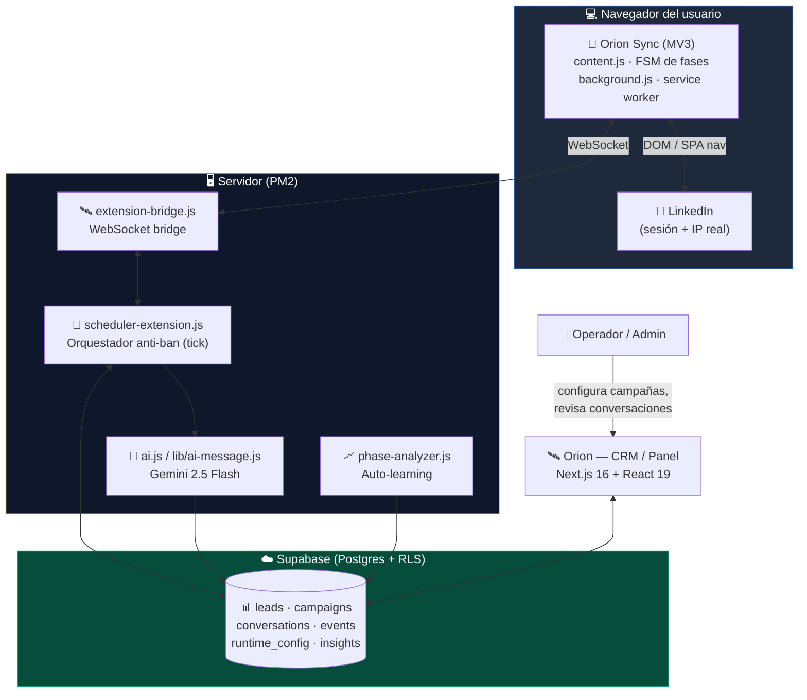
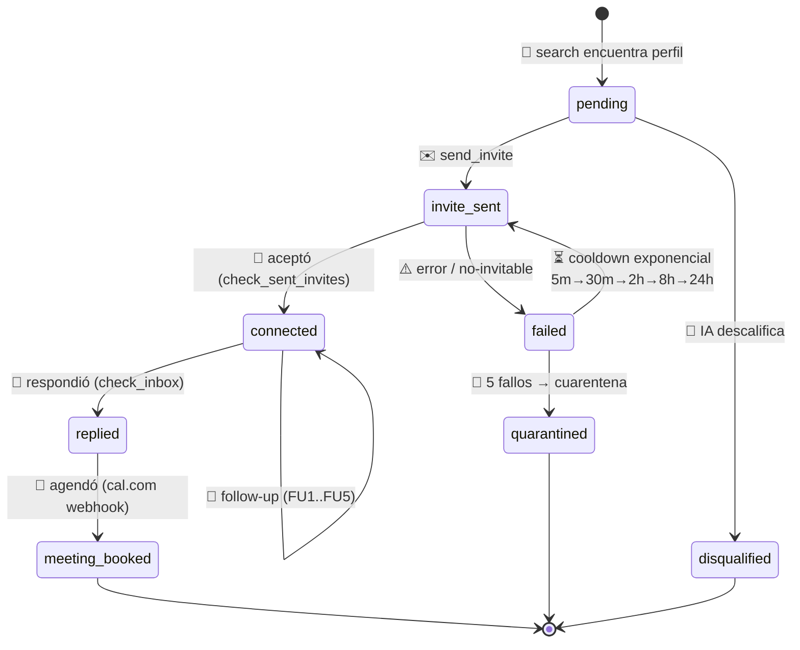
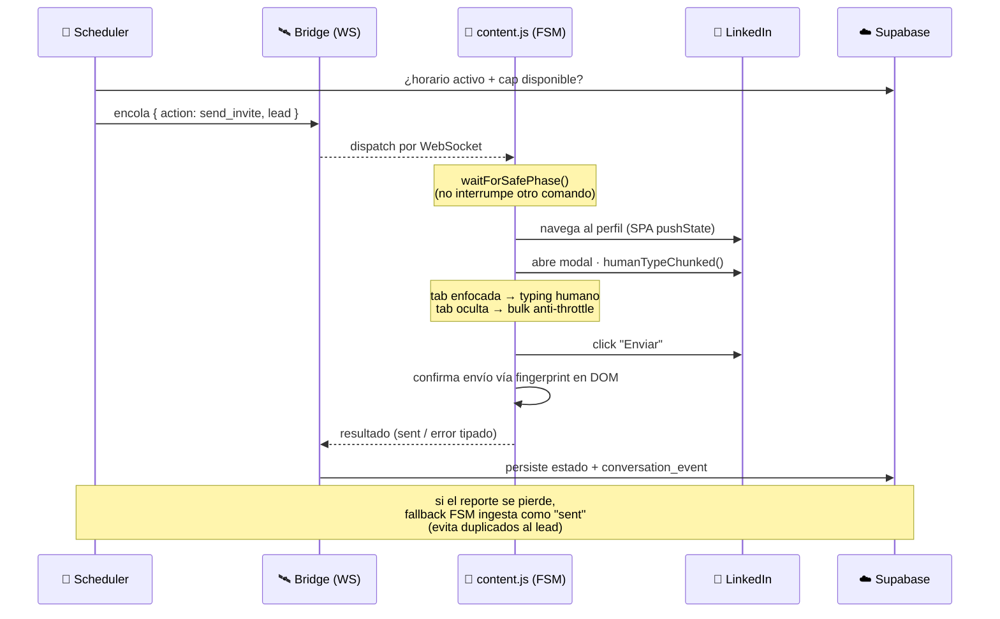
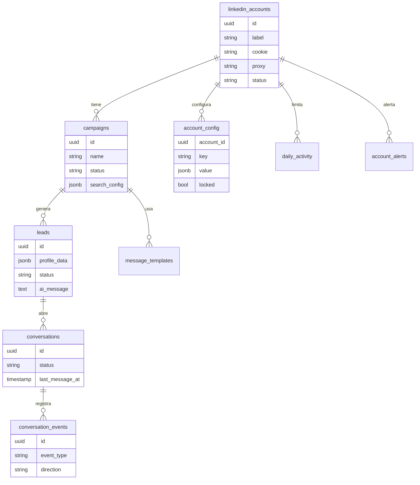

<div align="center">

# 🦅 ClawBot

### Plataforma autónoma de prospección en LinkedIn — un SDR que trabaja 24/7 sin baneos

*Búsqueda → Calificación con IA → Invitación → Seguimiento → Conversación → Reunión, en piloto automático.*

<br/>


</div>

---

## 📑 Tabla de contenidos

- [¿Qué es ClawBot?](#-qué-es-clawbot)
- [Por qué "Smart Hybrid"](#-por-qué-smart-hybrid-el-problema-del-multi-ip)
- [Arquitectura](#-arquitectura)
- [El pipeline del lead](#-el-pipeline-del-lead-máquina-de-estados)
- [Anatomía de un comando](#-anatomía-de-un-comando-send_invite)
- [Los agentes de LinkedIn](#-los-agentes-de-linkedin)
- [Auto-aprendizaje (L1–L6)](#-auto-aprendizaje-l1l6)
- [Stack tecnológico](#-stack-tecnológico)
- [Estructura del monorepo](#-estructura-del-monorepo)
- [El dashboard (Orion)](#-el-dashboard-orion)
- [Modelo de datos](#-modelo-de-datos)
- [Puesta en marcha](#-puesta-en-marcha)
- [Operación y despliegue](#-operación-y-despliegue-pm2)
- [Roadmap](#-roadmap)
- [Aviso legal](#-aviso-legal--uso-responsable)

---

## 🎯 ¿Qué es ClawBot?

ClawBot es un **SDR (Sales Development Representative) autónomo** para LinkedIn. Automatiza el embudo completo de prospección outbound — encuentra perfiles que encajan con el cliente ideal, los **califica con IA**, envía la invitación, da **seguimiento humano** cuando conectan, **lee las respuestas** y agenda la reunión — todo respetando los límites de actividad de una persona real para **no levantar sospechas ni baneos**.

Está compuesto por dos productos que comparten una base de datos:

| Producto | Rol | Stack |
|----------|-----|-------|
| 🔥 **Prometheus** | El motor de automatización (orquestador, IA, bridge) | Node.js (ESM) |
| 🛰️ **Orion** | El CRM + panel de control web | Next.js 16 + React 19 |
| 🧩 **Orion Sync** | La extensión Chrome que ejecuta en la IP/sesión real del usuario | Manifest V3 |

---

## 🛡️ Por qué "Smart Hybrid": el problema del multi-IP

La forma "obvia" de automatizar LinkedIn —un servidor con Playwright headless— **se detecta y banea**: el login del usuario aparece operando desde una IP de datacenter distinta a la de su casa/oficina. LinkedIn lo marca al instante.

ClawBot resuelve esto con una arquitectura **Smart Hybrid**: el servidor **decide qué hacer**, pero **quien lo ejecuta es la propia extensión de Chrome del usuario**, en su navegador, con su sesión y su IP real. Para LinkedIn, es indistinguible de la persona usando la plataforma normalmente.

```
❌ Enfoque clásico (baneable)        ✅ Smart Hybrid (ClawBot)
┌──────────────┐                     ┌──────────────┐   manda órdenes   ┌─────────────────┐
│ Servidor con │── IP datacenter ──▶ │  Servidor    │ ════════════════▶ │ Chrome del user │
│  Playwright  │   ⚠️ sospechoso     │ (el cerebro) │ ◀════ resultados ═│ + extensión MV3 │
└──────────────┘                     └──────────────┘                   └────────┬────────┘
                                                                                 │ IP/sesión REAL
                                                                                 ▼
                                                                            🔵 LinkedIn
```

> El servidor nunca toca LinkedIn directamente. Solo el navegador del usuario lo hace.

---

## 🏗️ Arquitectura



**Flujo en una frase:** el `scheduler` decide la siguiente acción según horario y estado → la encola en el `bridge` → la extensión la ejecuta en LinkedIn → reporta el resultado → se persiste en Supabase → la IA genera el mensaje → Orion lo muestra al operador.

---

## 🔄 El pipeline del lead (máquina de estados)



- **Calificación con IA**: antes de invitar, Gemini decide si el perfil encaja con las reglas de la campaña.
- **Cooldown + cuarentena (FIFO)**: un lead que falla nunca bloquea la cola; reintenta con backoff exponencial y se aísla al 5.º fallo con evidencia.
- **Seguimientos humanos**: hasta 5 follow-ups escalonados (FU1 ~4h, luego 40/72/96/120h) con tono de **relación**, no de venta agresiva.

---

## ⚙️ Anatomía de un comando (`send_invite`)



Cada acción es **idempotente y observable**: la FSM en `content.js` es la única fuente de verdad del estado del navegador, y el bridge tiene fallbacks para que un corte de WebSocket no genere mensajes duplicados ni leads "fantasma".

---

## 🤖 Los agentes de LinkedIn

ClawBot opera como un conjunto de "agentes", cada uno responsable de una fase del embudo:

| Agente | Qué hace |
|--------|----------|
| 🔎 `search` | Scrapea perfiles desde la búsqueda de LinkedIn (keywords + filtros) |
| ✉️ `send_invite` | Envía la invitación de conexión (con/sin nota según campaña) |
| 🔁 `check_sent_invites` | Detecta qué invitaciones fueron **aceptadas** → `connected` |
| 📥 `check_inbox` | Lee respuestas entrantes → `replied`, dispara auto-reply |
| 💬 `send_followup` | Manda seguimientos escalonados a quienes conectaron y no respondieron |
| 🧹 *deep sweep* | 1×/día rescata inbounds "sepultados" más allá del top-18 del inbox |

> **Anti-throttle:** Chrome ralentiza `setTimeout` a ~1/min en pestañas en segundo plano. ClawBot lo neutraliza enfocando la pestaña durante la ejecución y cayendo a inserción *bulk* cuando la pestaña está oculta — convirtiendo tareas de 125s en ~15s.

---

## 🧠 Auto-aprendizaje (L1–L6)

El sistema se diagnostica y se cura solo. Cada nivel sube la autonomía:

```
L1  📊 Phase Analytics    Cada comando emite checkpoints DOM-driven → detecta 6 patrones
                          (selector_drift, latency_drift, timeouts, lead_stuck...)
L2  💡 Sugerencias        Propone selectores nuevos (humano aprueba)
L3  ⏱️ Auto-tune          Ajusta timeouts solo, según latencia real observada
L4  🔀 Auto-reorder       Reordena la cadena de envío por tasa de éxito
L5  🏷️ Auto-clasificación Etiqueta errores nuevos como infra vs. fallo de cuenta
L6  👁️ Visual Learning    3× timeouts → screenshot + DOM snapshot → ticket;
                          el admin hace click en la imagen → genera selector estable
```

Todo se persiste en `phase_insights`, `learned_selectors`, `selector_tickets` y `runtime_config`, y es visible en el dashboard (`/dashboard/auto-learning`, `/dashboard/visual-tickets`).

---

## 🧰 Stack tecnológico

| Capa | Tecnología |
|------|-----------|
| **Frontend / CRM** | Next.js 16 (App Router) · React 19 · Tailwind CSS v4 · TypeScript |
| **Backend / Motor** | Node.js (ESM) · Express · WebSocket |
| **Extensión** | Chrome Manifest V3 (service worker + content script) |
| **IA** | Google **Gemini 2.5 Flash** (`@google/genai`) — calificación + generación de mensajes |
| **Base de datos** | Supabase (PostgreSQL + Row Level Security + Auth) |
| **Infra** | PM2 · Xvfb (display virtual para el Chrome de cada cuenta) |
| **Integraciones** | cal.com (webhook de reuniones) · proxies residenciales |

---

## 📂 Estructura del monorepo

```
clawbot/
├── apps/
│   ├── prometheus/                 🔥 Motor de automatización (Node ESM)
│   │   ├── scheduler-extension.js  🧠 Orquestador central (tick anti-ban)   ← PROCESO VIVO
│   │   ├── extension-bridge.js     🛰️ WebSocket bridge ↔ extensión          ← PROCESO VIVO
│   │   ├── ai.js                   🤖 Gemini: qualify + generar mensaje
│   │   ├── phase-analyzer.js       📈 Cron de auto-aprendizaje (L1–L5)
│   │   ├── lib/                     🧩 ai-message · extension-dispatch · lead-failure
│   │   │                              group-conversation · humanize · supabase ...
│   │   └── scripts/                 🧪 Backfills, stress-tests, inspectores DOM
│   │
│   ├── orion/                      🛰️ CRM + Panel (Next.js 16 App Router)
│   │   ├── app/dashboard/           📊 leads · campaigns · conversations · crm
│   │   │                              funnel · control · accounts · monitor ...
│   │   ├── app/api/                  🔌 cal-webhook · runtime-config · extension · crm ...
│   │   └── lib/                      🛠️ config-fields · config-presets · config-validation
│   │
│   └── orion-extension/            🧩 Orion Sync (Chrome MV3, v0.7.47)
│       ├── content.js               FSM de fases (fuente de verdad del navegador)
│       ├── background.js            Service worker (cola + heartbeat)
│       └── manifest.json
│
├── packages/
│   └── db-types/                   📐 Tipos TypeScript generados de Supabase
│
└── ecosystem.config.cjs            🚀 PM2
```

> ℹ️ **Nota de arquitectura:** la versión vigente es **Smart Hybrid** (extensión + bridge). Los archivos `worker.js` / `batch.js` / `inbox.js` / `scheduler.js` pertenecen a la arquitectura Playwright/Voyager **anterior** y se conservan como referencia histórica; no los ejecuta ningún proceso.

---

## 🛰️ El dashboard (Orion)

| Ruta | Descripción |
|------|-------------|
| `/dashboard` | KPIs: enviados / conectados / respondieron + actividad reciente |
| `/dashboard/funnel` | 📉 Embudo Invitados→Conectados→Respondieron→Citas + "Acción requerida" |
| `/dashboard/control` | ⚙️ Centro de Control por cuenta (hub) |
| `/dashboard/accounts/[id]/config` | 🎛️ Todos los parámetros del agente IA por cuenta + presets anti-ban |
| `/dashboard/leads` · `/leads/[id]` | Leads con estado, badge de respuesta e historial |
| `/dashboard/conversations` | 💬 Bandeja de mensajes recibidos |
| `/dashboard/campaigns` | 🎯 Gestión de campañas y templates de mensaje |
| `/dashboard/crm` | 🔮 "Ojo de Dios": smart-sync, decisión del scheduler, audit log + undo |
| `/dashboard/monitor` | 📡 `scheduler_log` en tiempo real |
| `/dashboard/auto-learning` · `/visual-tickets` | 🧠 Insights de IA + tickets de selectores |
| `/dashboard/users` | 👤 Gestión de usuarios (roles: `god_admin > admin > user`) |

---

## 🗄️ Modelo de datos



**Estados de `conversations.status`:** `initiated · connected · active · meeting_booked · dead · closed_won · closed_lost`
**`conversation_events.event_type`:** `invite_sent · invite_accepted · message_sent · reply_received · follow_up_sent · meeting_confirmed ...`

---

## 🚀 Puesta en marcha

### Requisitos

- Node.js (ESM) + npm workspaces
- Una instancia de **Supabase** (URL + service key)
- API key de **Google Gemini**
- Google Chrome con la extensión **Orion Sync** cargada (una por cuenta de LinkedIn)

### Variables de entorno

```bash
# apps/prometheus/.env
SUPABASE_URL=...
SUPABASE_SERVICE_KEY=...
GEMINI_API_KEY=...

# apps/orion/.env.local
NEXT_PUBLIC_SUPABASE_URL=...
NEXT_PUBLIC_SUPABASE_ANON_KEY=...
SUPABASE_SERVICE_KEY=...
```

### Desarrollo local

```bash
npm install                 # instala todos los workspaces

npm run orion               # 🛰️ dashboard en http://localhost:3000
npm run types               # 📐 regenera tipos de Supabase

# motor (desde apps/prometheus/)
node scheduler-extension.js # 🧠 orquestador
node extension-bridge.js    # 🛰️ bridge WebSocket
```

---

## 🛠️ Operación y despliegue (PM2)

En producción corren **4 procesos** vía PM2:

| Proceso | Script | Rol |
|---------|--------|-----|
| `orion` | `npm start` (Next.js) | CRM / Panel (:3000) |
| `prometheus-scheduler` | `scheduler-extension.js` | Orquestador anti-ban |
| `extension-bridge` | `extension-bridge.js` | WebSocket ↔ extensiones |
| `xvfb` | — | Display virtual para los Chrome |

```bash
pm2 list                          # estado de los procesos
pm2 logs prometheus-scheduler     # logs del orquestador en vivo
pm2 restart prometheus-scheduler extension-bridge   # reiniciar JUNTOS (comparten lib)
pm2 save                          # persistir para sobrevivir reboots
```

> ⏰ **Horario (hora de México):** invitaciones/búsqueda Lun–Vie 09–19h · lectura de inbox Lun–Sáb 08–21h · tick base ~30 min con jitter. Configurable por campaña y por cuenta.

---

## 🗺️ Roadmap

- [x] 🧩 Arquitectura Smart Hybrid (extensión + bridge) — sin baneos multi-IP
- [x] 🤖 Calificación y mensajes con Gemini 2.5 Flash
- [x] 🧠 Auto-aprendizaje L1–L6 (self-healing de selectores)
- [x] 🎛️ Centro de Control por cuenta + presets anti-ban
- [x] 📉 Funnel analytics + tracking de reuniones (cal.com)
- [ ] 📅 Subir la conversión **respuesta → reunión** (cuello de botella actual)
- [ ] 🌎 Búsqueda multi-país (geoUrn array)
- [ ] 📱 Mejoras de UI móvil del dashboard

---

## ⚖️ Aviso legal & uso responsable

Este es un proyecto **privado** con fines de automatización de ventas B2B. La automatización de LinkedIn puede contravenir sus Términos de Servicio: úsalo bajo tu propia responsabilidad, con cuentas propias, volúmenes humanos y consentimiento de los titulares de las cuentas. ClawBot está diseñado explícitamente para **respetar límites de actividad realistas** y operar desde la sesión/IP del propio usuario, precisamente para no abusar de la plataforma ni de los prospectos.

---

<div align="center">

**ClawBot** — *búsqueda → reunión, en piloto automático.* 🦅

<sub>Prometheus (motor) · Orion (CRM) · Orion Sync (extensión) — un monorepo, un pipeline.</sub>

</div>
